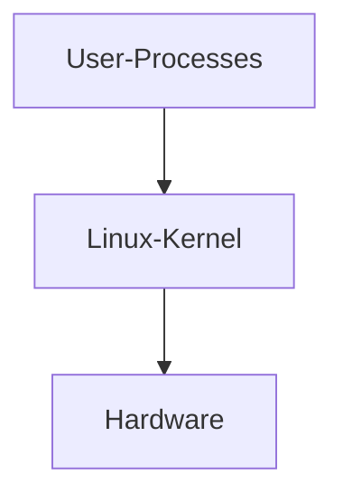

# Linux
Notes on "How Linux Works" book

## The Big Picture

A linux system has 3 main levels

**Hardware** - Hardware consists of CPU and memory, CPU for Computation and to read and from and write to memory, External devices like disks and network interfaces are also part of hardware
**Kernel** - Kernel is a software residing in the memory which tell CPU what to do, it acts as an interface between hardware and any running program.
**Processes** - The running program that kernel manages

*Kernel run in kernel mode and user process runs in user mode* -  this gives dangerous privilege to kernel code.